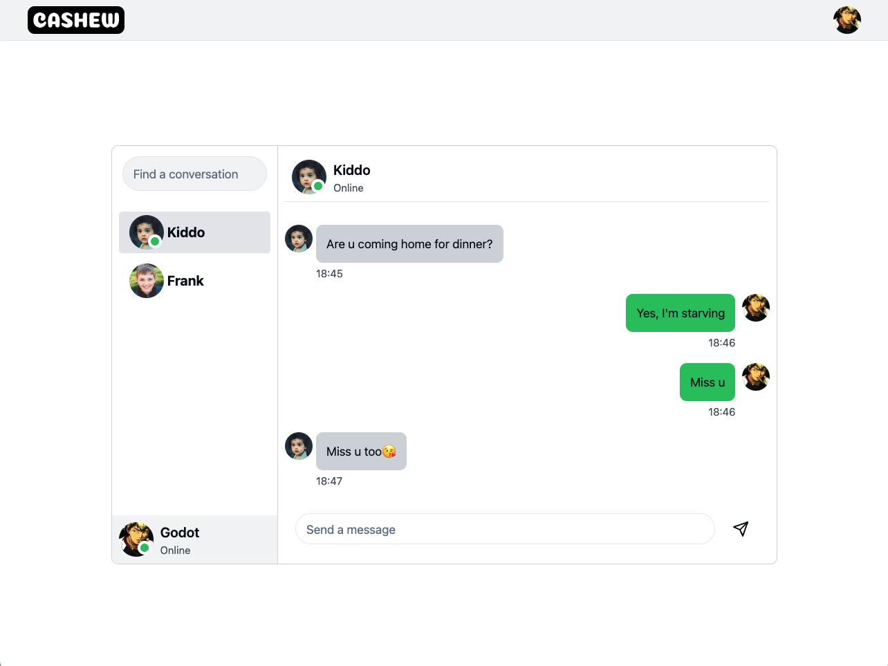

# Cashew


Cashew is a simple chat application built with [the MERN stack](https://www.mongodb.com/mern-stack).



## Features

1. Authentication&Authorization with JWT
2. Google/GitHub login support
3. Real-time messaging
4. Online status display
5. Contact list search
6. Responsitve UI design

## Usage

```bash
# Clone the repo
git clone https://github.com/iamgodot/cashew.git
cd cashew

# Setup env file(fill in the variables)
cp .env.example .env

# Install dependencies
npm i

# Run api server
npm run server

# Run app
npm run dev
```

## Contributing

Feel free to [open an issue](https://github.com/iamgodot/cashew/issues) or submit a pull request.

## License


